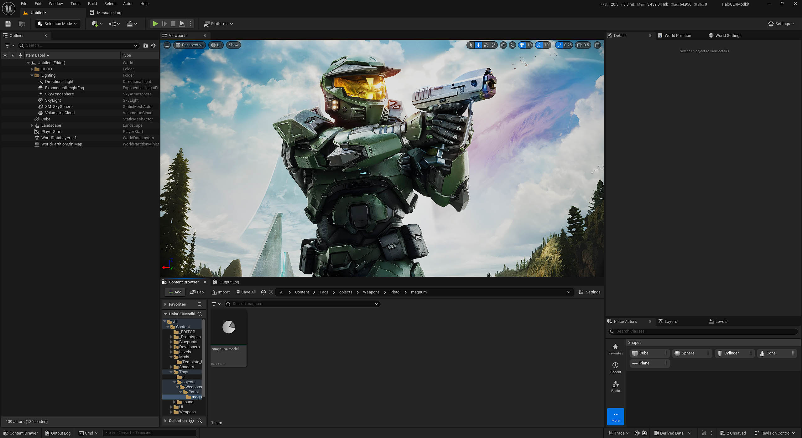

# Unreal Engine 5.5 Project acting as a modkit for Halo: Campaign Evolved

C++ Project containing various game modules, allowing for modders to easily create Blueprint mods or otherwise replace assets.

## Major features

- Unreal Engine Project setup with numerous modules from the game exposed to be used in Blueprint scripting or asset replacement.
- Wwise Integration
- Template mods to build off of

## Basic Installation

- Download Unreal Engine 5.5 from the Epic Games Launcher
- Download Visual Studio 2022 for Unreal Engine: https://dev.epicgames.com/documentation/unreal-engine/setting-up-visual-studio-development-environment-for-cplusplus-projects-in-unreal-engine?lang=en-US
- Clone this repository to a safe directory
- Download the Wwise Launcher and integrate the Wwise Version 2023.1.17.8841 to the project, as well as directing it to the project's Wwise project.
- Download the PlayFab plugin from Fab and integrate it into your engine installation
- In the project folder, right click the HaloCERModkit.uproject file and choose "Generate Visual Studio Project Files"
- When it's done, open the HaloCERModkit.sln file, and in the solution explorer, right click "HaloCERModkit" and choose "Build"
- Once complete, you can now open the project via the HaloCERModkit.uproject file

## Packaging Mods

- Ensure your mod is referenced by a PrimaryAssetLabel Data Asset. See Template mod for an example
- in the main viewport of Unreal Engine, click "Platforms" and then choose Windows->Package Project
- Once complete, you will have a folder called "Windows" in the directory you chose, inside of here, look for "HaloCERModkit/Content/Paks" your modded PAK files will be in here, identified by the number you specified for your PrimaryAssetLabel.
- Simply rename these to your desired mod name and drag them to the appropriate folder, for UE4SS mods they must go in "LogicMods" and be renamed to the same as your folder.

## Credits

Modkit development members
- [Mal0-1471](https://github.com/Mal0-1471): Modkit Project Maintainer
  
Additional Support
- [GameBreaker](https://github.com/GameOverloads): Virtual Texture import plugin

Tool used for dumping game header files.
- [UE4SS Fork by RSDTools](https://www.nexusmods.com/halocampaignevolved/mods/9)

## Other Useful Tools

- [FModel](https://github.com/4sval/FModel): Game Archive Explorer and Exporter
- [UAssetGUI](https://github.com/atenfyr/UAssetGUI): Cooked asset editor and Archive Explorer
- [Retoc](https://github.com/trumank/retoc): Commandline based packaging tool that allows manually edited cooked files to be packaged
